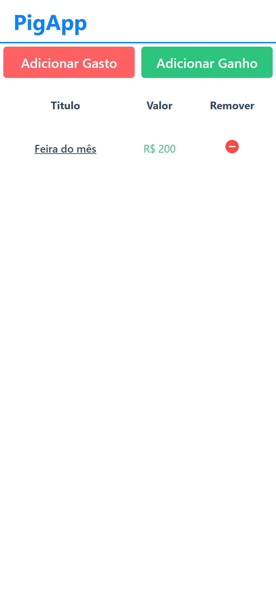
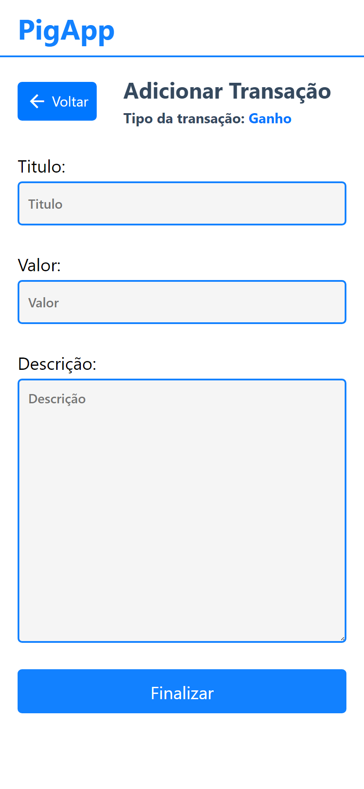
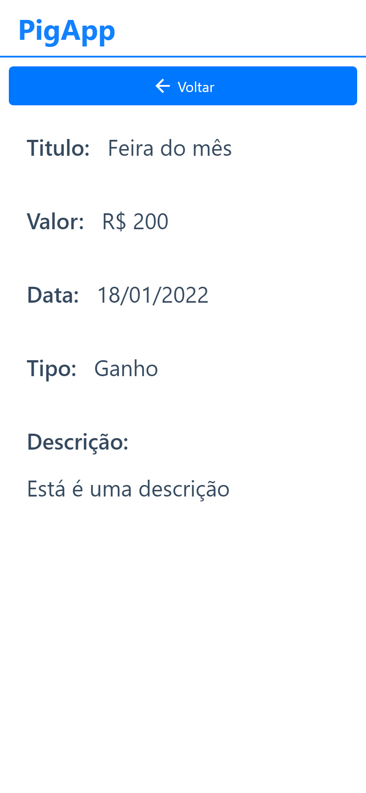

<h1 align="center">PigApp</h1>
<p align="center">Este projeto consiste em anotar(registrar) todos os gastos e ganhos de dinheiro feito pelo usuário, com uma interface intuitiva, ou seja, quando o usuário gastar dinheiro comprando algo ele pode anotar no PigApp, junto das informações de data, descrição, valor e titulo.</p>
<br>

<p align="center">
       
</p>

<br>

| Listagem de Transações | Adicionar Transação | Detalhes da Transação |
|------------------------|---------------------|-----------------------|
| |  |  |


<!-- ## Project setup
```
npm install
```

### Compiles and hot-reloads for development
```
npm run serve
```

### Compiles and minifies for production
```
npm run build
```

### Lints and fixes files
```
npm run lint
```

### Customize configuration
See [Configuration Reference](https://cli.vuejs.org/config/). -->
